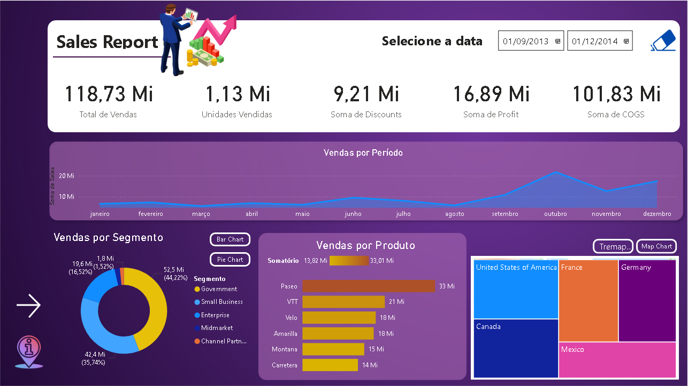
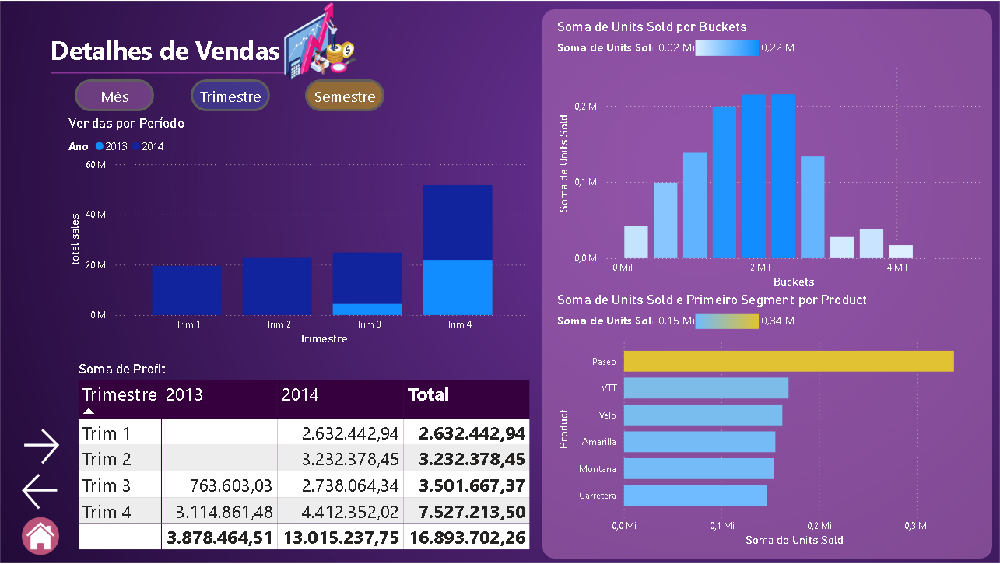

# 📊 Projeto Power BI – Dashboard de Vendas

Este repositório contém um projeto de dashboard interativo desenvolvido com **Power BI**, focado na análise de vendas por período, país, segmento e produto. O projeto faz parte da formação **Power BI Analyst** oferecida pela [DIO (Digital Innovation One)](https://www.dio.me/), e tem como objetivo aplicar na prática conceitos de visualização de dados, modelagem e storytelling analítico.

## 🧭 Navegação entre Páginas

Para melhorar a experiência do usuário, foram adicionados **botões de navegação** entre as páginas do relatório, permitindo transições suaves e intuitivas. Também foi incluído um **botão de acesso à página Home**, facilitando o retorno à visão geral do projeto a qualquer momento.

---

## 📁 Estrutura do Dashboard

O projeto é composto por diversas páginas que exploram diferentes aspectos da performance de vendas:

### 🏠 Home
- Apresenta o título do projeto, o propósito da análise e um botão para iniciar a navegação.

### 💰 Relatório Financeiro
- Visão consolidada de indicadores financeiros:
  - Total de vendas, unidades vendidas, descontos, lucro e COGS.
- Gráficos mostram:
  - Vendas por período.
  - Vendas por segmento (ex: Consumer, Small Business).
  - Vendas por produto e por país.
- Útil para decisões estratégicas e análise de rentabilidade.

### 📈 Detalhes de Vendas
- Análise comparativa entre os anos de **2013 e 2014**.
- Gráficos de barras e tabelas mostram:
  - Vendas por trimestre.
  - Unidades vendidas por segmento de produto.
  - Distribuição de vendas por faixas (buckets).
- Ideal para entender o crescimento e sazonalidade das vendas.

### 🌍 Análise por País e Mês
- Visualizações que destacam:
  - Os **Top 5 meses** com maior volume de vendas.
  - Evolução mensal de unidades vendidas e receita.
  - Os **Top 3 países** com maior desempenho.
  - Comparativo de vendas por produto em diferentes países.
- Excelente para identificar mercados estratégicos e períodos de pico.

---

## 🚀 Tecnologias Utilizadas

- **Power BI Desktop**
- Modelagem de dados com DAX
- Visualizações interativas
- Navegação com botões e bookmarks

---

## 📚 Créditos

Este projeto foi desenvolvido como parte da **formação Power BI Analyst** da [DIO](https://www.dio.me/), com foco em aplicar os conhecimentos adquiridos em um cenário real de análise de dados.

---

## 📌 Observações

Sinta-se à vontade para explorar, clonar ou contribuir com este projeto. Feedbacks são sempre bem-vindos!

